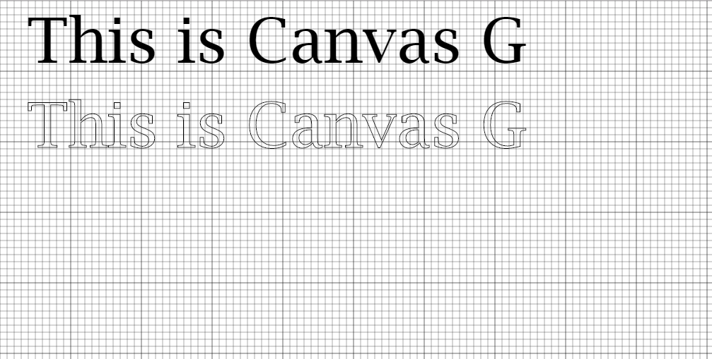

# CANVA - G

**Canvas graph ( canvaG ) is a graph for getting accurate and appropriate positioning of canvas elements when using canvas.**




Usage
=====================
### Npm
##### Installation
`npm i canvag`
* Add the `<script src="node_modules/canvag/canvaG.js"></script>` to your HTML file

### Js Delivr
`cdn.jsdelivr.net/npm/canvag@1.0.2`

### Github
Direct cloning and adding `<script src="canvaG.js"></script>` to your HTML file instead

create any element in and put the `<canvas id="canvas"></canvas>` tag in the element;
```html
<div id="drawing"><canvas id="canvas"></canvas></div>
```

In your js file, you should call the `drawGraph(xgap, ygap, width height)` function : The Graph above has the following parameters:
```js
    drawGraph(10, 10);
```
> Neglecting the width and the height because the default width is the entire width and default height is the entire height


>| Argument | Default value |
>|----------|---------------|
>|xgap|10|
>|ygap|10|
>|width|Entire width|
>|height|Entire Height|
>
>`drawGraph()` without any argument will surely work with the default parameters


>[Github Direct Cloning and Contribution](https://github.com/Qudusayo/CanvaG)
